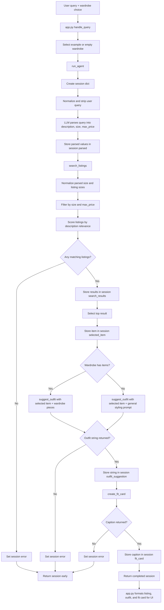

# FitFindr — planning.md

> Complete this document before writing any implementation code.
> Your spec and agent diagram are what you'll use to direct AI tools (Claude, Copilot, etc.) to generate your implementation — the more specific they are, the more useful the generated code will be.
> Your planning.md will be reviewed as part of your submission.
> Update it before starting any stretch features.

---

## Tools

List every tool your agent will use. For each tool, fill in all four fields.
You must have at least 3 tools. The three required tools are listed — add any additional tools below them.

### Tool 1: search_listings

**What it does:**
<!-- Describe what this tool does in 1–2 sentences -->
This function takes the parsed `description`, optional `size`, and optional `max_price` from the agent loop and searches `listings.json` for matching items. It filters by price and size when those values are provided, normalizes size values before comparing them, scores the remaining listings by relevance to the description, and returns matching listing dictionaries sorted from most to least relevant.

**Input parameters:**
<!-- List each parameter, its type, and what it represents -->
- `description` (str): Keywords or a brief description of the clothing item the user is looking for.
- `size` (str | None): Optional size filter parsed from the user's query. If None, size filtering is skipped.
- `max_price` (float | None): Optional maximum listing price parsed from the user's query. If None, price filtering is skipped.

**What it returns:**
<!-- Describe the return value — what fields does a result contain? -->
The function will return a list of dictionaries. The dictionaries are sorted by relevancy in most to least order.
To ensure our data retains schema, the happy path for the function will return:
- list[dict]

Before applying the size filter, the tool normalizes both the parsed size input and each listing's `size` value by lowercasing, stripping whitespace, removing helper words like "size", and preserving meaningful characters like digits, slashes, decimals, and waist/shoe prefixes. This lets values like "Medium", "size M", "US size 8.5", and "W30 L30" match the dataset more reliably.

Each dictionary item contains:
- `id` (str)
- `title` (str)
- `description` (str)
- `category` (str)
- `style_tags` (list[str])
- `size` (str)
- `condition` (str)
- `price` (float)
- `colors` (list[str])
- `brand` (str | None)
- `platform` (str)

**What happens if it fails or returns nothing:**
<!-- What should the agent do if no listings match? -->
If no listings match, the function returns an empty list. The agent checks whether the returned results list is empty, stores a helpful message in `session["error"]`, stops the workflow before calling `suggest_outfit`, and returns the session.
---

### Tool 2: suggest_outfit

**What it does:**
<!-- Describe what this tool does in 1–2 sentences -->
This tool will take in a `new_item` from the relevancy list and the user's wardrobe which may be empty. The function will prompt an LLM with these inputs as context and a dedicated system prompt which instructs the LLM to create one or two outfits from the context.

**Input parameters:**
<!-- List each parameter, its type, and what it represents -->
- `new_item` (dict): A dictionary representing the item selected from `listings`.
- `wardrobe` (dict): The wardrobe schema dictionary that represents the user's current clothing items. Items could be empty.

**What it returns:**
<!-- Describe the return value -->
The function will return a non-empty string result from the LLM model which describes one or two suggested outfits.

**What happens if it fails or returns nothing:**
<!-- What should the agent do if the wardrobe is empty or no outfit can be suggested? -->
If the wardrobe exists but has no items, the function still calls the LLM and asks for general styling advice for the new item instead of specific outfit combinations. If the LLM call fails or returns an empty response, the function will return an empty string.

The agent will then check for these edge cases before continuing to call create_fit_card. If the cases are present, the agent may make a final call to the LLM with the context and errors to return a useful response to the user.
---

### Tool 3: create_fit_card

**What it does:**
<!-- Describe what this tool does in 1–2 sentences -->
This tool will take `outfit` and `new_item` input values, validate their data presence, call an LLM model for a suggested caption, and return the suggested caption.

**Input parameters:**
<!-- List each parameter, its type, and what it represents -->
- `outfit` (str): The outfit suggestion string from suggest_outfit.
- `new_item` (dict): The dictionary element collected from search_listings.

**What it returns:**
<!-- Describe the return value -->
This tool will return a natural and casual sounding string which contains a 2-4 sentence Instagram/TikTok caption. The caption will include the item name, price, and platform in a natural manner. The caption captures the outfit vibe in specific details. Lastly, the caption will return different for each query by setting a high temperature value to the LLM call.

**What happens if it fails or returns nothing:**
<!-- What should the agent do if the outfit data is incomplete? -->
- If the values for `new_item` and `outfit` are missing or empty, the tool should early return a descriptive error string.
---

### Additional Tools (if any)

<!-- Copy the block above for any tools beyond the required three -->

---

## Planning Loop

**How does your agent decide which tool to call next?**
<!-- Describe the logic your planning loop uses. What does it look at? What conditions change its behavior? How does it know when it's done? -->
- The agent loop will receive the user's query and wardrobe as arguments.
- The agent loop also has access to the state session.
- User query is normalized and stripped.
- Set session['wardrobe'] to wardrobe
- Call an LLM model in the agent loop to parse the user's natural language query into structured values: `description`, `size`, and `max_price`.
- Parse the LLM response and store the structured values in `session["parsed"]`.
- Call search_listings with `description`, `size`, and `max_price`.
- Inside `search_listings`, normalize the parsed size and each listing size before comparing them. The LLM extracts the size from the query, but the search tool owns the matching logic.
- Check if the returned list is empty, if so, set session['error'] with a helpful message, stop the workflow, and return the session.
- Set results to session['search_results'].
- Set top result to session['selected_item'].
- Call suggest_outfit with `new_item` and `wardrobe`
- Check if result is an empty string, if so, set session['error'] and return the session.
- Set session['outfit_suggestion'] to result.
- Call create_fit_card with suggested `outfit` and `new_item`.
- Check results are non-empty, if not, set session['error'] and return the session.
- Set session['fit_card'] to result.
- Return the session.
---

## State Management

**How does information from one tool get passed to the next?**
<!-- Describe how your agent stores and accesses state within a session. What data is tracked? How is it passed between tool calls? -->
The agent stores all information for one user interaction in a `session` dictionary. The session starts with the original user `query`, the user's `wardrobe`, empty parsed values, empty tool results, and `error` set to None.

After the agent parses the user's natural language query, it stores the structured values in `session["parsed"]`, including `description`, `size`, and `max_price`. Those parsed values are passed into `search_listings`, and the returned list is stored in `session["search_results"]`.

If search results exist, the agent selects the top result and stores it in `session["selected_item"]`. That selected item is passed into `suggest_outfit` along with `session["wardrobe"]`, and the returned outfit string is stored in `session["outfit_suggestion"]`.

The agent then passes `session["outfit_suggestion"]` and `session["selected_item"]` into `create_fit_card`. The returned caption is stored in `session["fit_card"]`. If any required step fails or returns empty data, the agent stores a helpful message in `session["error"]` and returns the session early instead of continuing to the next tool.

---

## Error Handling

For each tool, describe the specific failure mode you're handling and what the agent does in response.

| Tool | Failure mode | Agent response |
|------|-------------|----------------|
| search_listings | No results match the query | Store a helpful message in `session["error"]`, stop the workflow, and return the session before calling `suggest_outfit`. |
| suggest_outfit | Wardrobe is empty | Treat this as a supported alternate path, not a failure. The tool asks the LLM for general styling advice instead of wardrobe-specific outfit combinations, and the agent stores the returned string in `session["outfit_suggestion"]`. |
| suggest_outfit | LLM call fails or returns an empty response | Return an empty string from the tool. The agent checks for an empty result, stores a helpful message in `session["error"]`, stops the workflow, and returns the session before calling `create_fit_card`. |
| create_fit_card | Outfit input is missing or incomplete | Return a descriptive error string instead of raising an exception. The agent checks whether the result is empty before storing it in `session["fit_card"]`. |
| create_fit_card | New item input is missing or missing required fields | Return a descriptive error string instead of raising an exception. The agent stores the result if non-empty or sets `session["error"]` if no usable caption is returned. |

---

## Architecture

---

## AI Tool Plan

<!-- For each part of the implementation below, describe:
     - Which AI tool you plan to use (Claude, Copilot, ChatGPT, etc.)
     - What you'll give it as input (which sections of this planning.md, your agent diagram)
     - What you expect it to produce
     - How you'll verify the output matches your spec before moving on

     "I'll use AI to help me code" is not a plan.
     "I'll give Claude my Tool 1 spec (inputs, return value, failure mode) and ask it to implement
     search_listings() using load_listings() from the data loader — then test it against 3 queries
     before trusting it" is a plan. -->

**Milestone 3 — Individual tool implementations:**
I will use ChatGPT/Codex to help implement and review each individual tool in `tools.py`. For each tool, I will give the AI the matching tool section from this `planning.md`, the function stub from `tools.py`, and any relevant data schema from `listings.json` or `wardrobe_schema.json`.

For `search_listings`, I will give the AI the Tool 1 spec and ask it to implement filtering by `max_price`, optional size matching with size normalization, keyword relevance scoring, and sorting by score. I expect it to produce a deterministic Python implementation that uses `load_listings()` and returns `list[dict]`. I will verify it with at least three manual tests: a query with expected matches, a query with a size filter, and a no-results query.

For `suggest_outfit`, I will give the AI the Tool 2 spec, the wardrobe schema, and examples of a selected listing and wardrobe. I expect it to produce an LLM prompt and Groq API call that returns a non-empty string with 1-2 outfit suggestions. I will verify it once with the example wardrobe and once with the empty wardrobe to confirm it gives generalized styling advice instead of failing.

For `create_fit_card`, I will give the AI the Tool 3 spec and examples of an outfit suggestion and selected listing. I expect it to produce an LLM prompt and Groq API call that returns a casual 2-4 sentence caption mentioning the item name, price, and platform. I will verify that it handles missing or empty outfit input gracefully and that a normal response sounds like a usable social caption.

**Milestone 4 — Planning loop and state management:**
I will use ChatGPT/Codex to help implement `run_agent()` in `agent.py` using the Planning Loop, State Management section, Error Handling table, and Architecture diagram from this file. I will ask it to keep the implementation aligned with the existing session keys: `query`, `parsed`, `search_results`, `selected_item`, `wardrobe`, `outfit_suggestion`, `fit_card`, and `error`.

I expect it to produce a planning loop that initializes the session, parses the user's natural language query into `description`, `size`, and `max_price`, calls the tools in order, stores each result in session state, and returns early with `session["error"]` if a required step fails. I will verify the result with the CLI examples in `agent.py`: a happy-path graphic tee query and the deliberate no-results query.

After `run_agent()` works, I will use ChatGPT/Codex to help implement `handle_query()` in `app.py`. I will give it the `app.py` TODO comments and the final session structure from `agent.py`. I expect it to select the correct wardrobe, call `run_agent()`, format the selected listing for the UI, and return the listing text, outfit suggestion, and fit card. I will verify it by running the Gradio app and trying both the example wardrobe and empty wardrobe paths.

---

## A Complete Interaction (Step by Step)

Write out what a full user interaction looks like from start to finish — tool call by tool call. Use a specific example query.

**Example user query:** "I'm looking for a vintage graphic tee under $30. I mostly wear baggy jeans and chunky sneakers. What's out there and how would I style it?"

**Step 1:**
<!-- What does the agent do first? Which tool is called? With what input? -->

**Step 2:**
<!-- What happens next? What was returned from step 1? What tool is called now? -->

**Step 3:**
<!-- Continue until the full interaction is complete -->

**Final output to user:**
<!-- What does the user actually see at the end? -->
